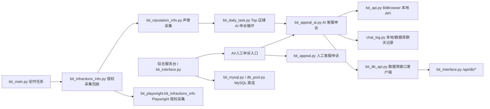
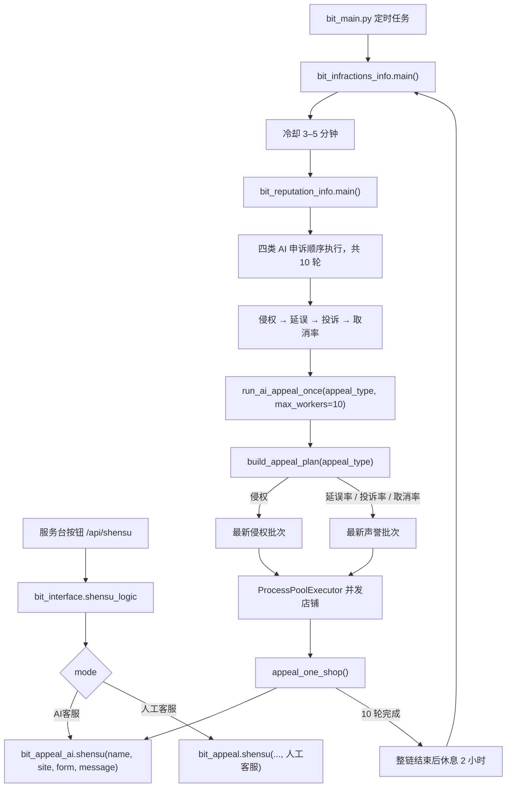
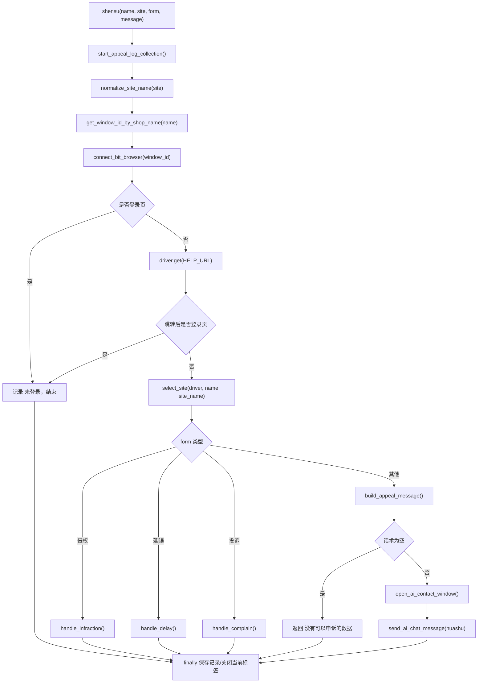
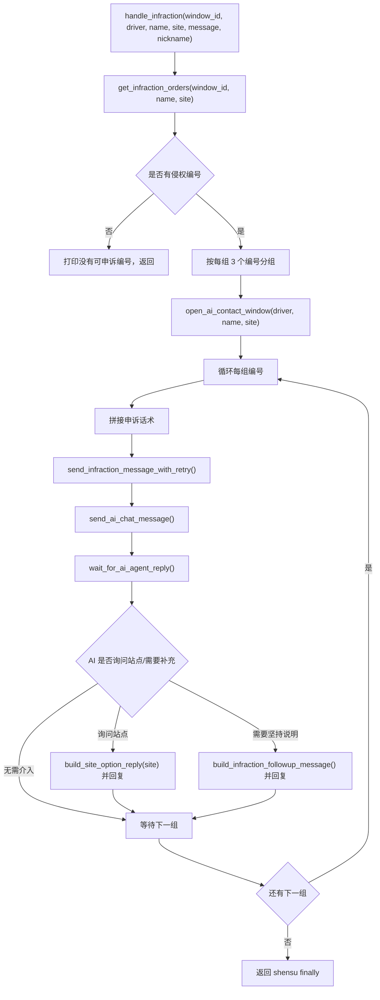
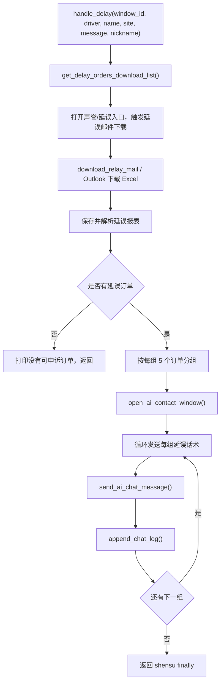
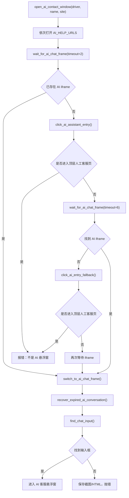

# bit / bit_playwright 模块注释与 AI 申诉逻辑图

本文档是代码阅读注释索引，不改变业务运行逻辑。范围包含：

- `bit/`：当前主要运行目录，包含 Flask 服务台、BitBrowser API、数据库接口、Selenium AI 申诉、采集任务。
- `bit_playwright/`：Playwright 版本/迁移目录，主要保存 Playwright 采集、旧版申诉和辅助脚本。

运行产物不纳入注释范围，例如 `.xlsx`、`.png`、`.html`、`.jsonl`、`runtime_locks/`。

## 总体结构

## bit 模块注释

| 文件 | 作用 | 关键入口/函数 | 注意点 |
| --- | --- | --- | --- |
| `__init__.py` | 标记 `bit` 为 Python 包。 | 无 | 无业务逻辑。 |
| `bit_api.py` | 封装 BitBrowser 本地接口。 | `openBrowser`, `closeBrowser`, `createBrowser` | 所有浏览器窗口打开/关闭都经过 `127.0.0.1:54345`。 |
| `bit_interface.py` | Flask 综合服务台，提供页面、登录、采集按钮、申诉流式日志、自动申诉任务和数据库代理接口。 | `shensu_logic`, `/api/shensu`, `/api/tasks/daily/*`, `/api/db/*`, `/api/infractions/*`, `/api/reputation/*` | 任务模块可选择侵权、延误率或取消率；服务端模式应直连 MySQL，外网客户端通过 `/api/db/*` 访问。 |
| `bit_main.py` | 总调度入口。 | `run_infraction_reputation_then_appeal`, `run_main_loop`, `build_scheduler` | 启动即执行一条任务链：侵权采集 -> 声誉采集 -> 侵权/延误/投诉/取消率 AI 申诉 10 轮（最多 10 个进程）；整条链结束后休息 2 小时再重新执行。 |
| `bit_daily_task.py` | 自动选择 Top 店铺，并分别执行侵权、延误率或取消率 AI 申诉。 | `auto_appeal_infraction`, `auto_appeal_delay`, `auto_appeal_cancellation`, `loop_ai_appeal` | 侵权计划来自最新侵权批次；延误率、取消率计划来自最新声誉批次。每个店铺内按站点串行，店铺间并发。 |
| `bit_appeal_ai.py` | 当前 AI 客服申诉主逻辑，使用 Selenium 控制 BitBrowser。 | `shensu`, `open_ai_contact_window`, `handle_infraction`, `handle_delay`, `send_ai_chat_message` | AI 客服只应识别右侧悬浮窗；人工客服页面不应混入该流程。 |
| `bit_appeal.py` | 人工客服申诉逻辑。 | `shensu`, `open_human_service_chat`, `wait_for_human_chat_input` | 这里处理 Hub/Chat 人工客服页面，不应和 AI 悬浮窗逻辑混用。 |
| `bit_infractions_info.py` | 侵权采集包装入口。 | `main` | 当前转发到 `bit_playwright.bit_infractions_info`。 |
| `bit_reputation_info.py` | 声誉、流量趋势、取消率等数据采集。 | `get_reputation_info`, `get_reputation_info_all`, `main` | 会打开 BitBrowser 并按配置文件站点采集。 |
| `bit_db_api.py` | 调用服务端数据库 HTTP 接口。 | `inset_infraction_info`, `get_latest_infraction_info`, `login_workbench_user` | 外网客户端避免直连 MySQL 时使用。 |
| `bit_mysql.py` | MySQL 表结构维护、写入、查询。 | `inset_infraction_info`, `get_latest_infraction_info`, `insert_ai_appeal_record` | 服务端直连数据库的主要实现。 |
| `db_pool.py` | MySQL 连接池。 | `get_db_connection` | 少数老接口可能使用连接池。 |
| `chat_log.py` | AI 申诉聊天日志采集、截断、落库。 | `start_appeal_log_collection`, `append_chat_log`, `stop_appeal_log_collection` | `bit_appeal_ai` 用它收集申诉全过程。 |
| `bit_download.py` | Outlook 邮件下载延误报表。 | `download_relay_mail`, `scan_email`, `download_excel` | 延误申诉会触发邮件下载和报表读取。 |
| `bit_email_info.py` | 邮件信息解析。 | `read_email_info_all`, `get_mail_info` | 偏数据读取辅助。 |
| `bit_summary_delayfile.py` | 汇总延误文件。 | `summary_delayFile` | 读取本地延误 Excel/CSV 后生成汇总。 |
| `bit_summary_info.py` | 旧版声誉汇总。 | `get_reputation_info`, `get_reputation_info_all` | 与 `bit_reputation_info.py` 有功能重叠。 |
| `bit_print.py` | 订单/打印相关操作。 | `print_orders`, `print_orders_all` | 独立业务脚本。 |
| `bit_update_orders.py` | 订单数据更新入库。 | `update_order_mysql` | 直连 MySQL 更新订单。 |
| `bit_switch_country.py` | 国家/站点切换辅助。 | `force_select_country`, `oepn_country_switch` | 旧版或局部复用的站点切换实现。 |
| `bit_clash.py` | Clash 代理节点控制。 | `switch_random_hongkong_node`, `get_public_ip` | 用于代理/IP 切换。 |
| `bit_utils.py` | 通用工具函数。 | `get_bit_path`, `get_now_time`, `getWindowidByName` | 多数脚本依赖这里定位配置和格式化时间。 |
| `bit_playwright.py` | 简单 Playwright 打开页面测试入口。 | `run`, `main` | 和 `bit_playwright/` 目录不同，属于 `bit` 内的独立测试脚本。 |
| `bit_selenium.py` | Selenium 连接测试/预留。 | 无主要业务函数 | 当前业务不应优先依赖。 |
| `bit_ visit_info.py` | 店铺访问量采集旧脚本。 | `get_visits_info` | 文件名含空格，导入时要注意。 |
| `bit_yuanyou.py` | 源佑页面/标题检测。 | `check_yuanyou_title` | 与商品采集辅助相关。 |
| `bit_zying.py` | 指营/1688 图像点击辅助。 | `click_aoxia_icon_by_image` | 依赖图像识别或页面自动化。 |
| `bit_zying_caiji.py` | 指营采集辅助。 | `check_yuanyou_title`, `get_all_ids` | 独立采集脚本。 |
| `bit_zying_check.py` | 指营检查辅助。 | `check_yuanyou_title`, `get_all_ids` | 独立检查脚本。 |
| `bit_zying_check_price.py` | 指营价格检查。 | `up1688`, `get_all_ids` | 独立价格检查脚本。 |
| `mercado_appeal_runner.py` | CDP 版本的自动申诉实验/稳定脚本。 | `open_bitbrowser`, `switch_site_if_needed`, `collect_infractions`, `ai_frame_id` | 与 Selenium 主线不同，避免与 `bit_appeal_ai.py` 同时操作同一窗口。 |
| `yuema_ai_stable_loop.py` | 跃马扬鞭专项稳定循环脚本。 | `ensure_assistant_open`, `wait_for_input`, `maybe_reply_site_option` | 店铺专项脚本，不是通用主入口。 |
| `download_test.py` | 下载测试。 | 无主要业务函数 | 测试脚本。 |
| `temp.py` | 临时脚本。 | 无 | 不建议作为业务依赖。 |

## bit_playwright 模块注释

| 文件 | 作用 | 关键入口/函数 | 注意点 |
| --- | --- | --- | --- |
| `__init__.py` | 标记 `bit_playwright` 包。 | 无 | 迁移后的 Playwright 包入口。 |
| `common.py` | Playwright 公共能力封装。 | `BitPlaywrightSession`, `load_sync_playwright`, `deep_click`, `select_country` | 建议 Playwright 新逻辑优先复用这里。 |
| `bit_infractions_info.py` | Playwright 侵权采集主实现。 | `get_infractions_info`, `get_infractions_info_all`, `_collect_current_infractions_tab` | 当前 `bit/bit_infractions_info.py` 会转发到这里。 |
| `bit_reputation_info.py` | Playwright 版声誉采集。 | `get_reputation_info`, `get_recent_visits_info` | 与 Selenium 版声誉采集可能重叠。 |
| `bit_appeal_ai.py` | Playwright/旧版 AI 申诉逻辑。 | `shensu`, `open_ai_contact_window`, `appeal_ai_recollect_loop` | 与 `bit/bit_appeal_ai.py` 不是同一条主线，避免混用。 |
| `bit_appeal.py` | Playwright/旧版人工或延误申诉入口。 | `shensu`, `auto_appeal_delay` | 旧版入口。 |
| `mercado_appeal_runner.py` | Playwright/CDP 申诉 runner。 | `main` | 与 `bit/mercado_appeal_runner.py` 有对应关系。 |
| `yuema_ai_stable_loop.py` | 跃马扬鞭专项循环入口。 | `main` | 店铺专项脚本。 |
| `bit_api.py` | BitBrowser API 相关旧/迁移代码。 | 无主要函数 | 需和 `bit/bit_api.py` 区分。 |
| `bit_mysql.py` | MySQL 旧/迁移代码。 | 无主要函数 | 服务端主线看 `bit/bit_mysql.py`。 |
| `db_pool.py` | 连接池旧/迁移代码。 | 无主要函数 | 服务端主线看 `bit/db_pool.py`。 |
| `bit_interface.py` | 旧/迁移服务台代码。 | 无主要函数 | 当前服务台主线看 `bit/bit_interface.py`。 |
| `bit_main.py` | 旧/迁移主入口。 | `print_orders`, `download_summary`, `main` | 与当前 `bit/bit_main.py` 不同。 |
| `bit_playwright.py` | 基础 Playwright 打开/跳转封装。 | `open_page`, `goto` | 轻量测试/工具。 |
| `bit_selenium.py` | Selenium 连接辅助。 | `connect_browser` | 迁移目录中的辅助脚本。 |
| `bit_download.py` | 延误邮件/报表下载旧逻辑。 | `download_relay_mail`, `scan_email`, `download_excel` | 与 `bit/bit_download.py` 功能相近。 |
| `bit_email_info.py` | 邮件解析。 | `read_email_info_all`, `get_mail_info` | 迁移副本。 |
| `bit_print.py` | 打印订单。 | `print_orders`, `print_orders_all` | 迁移副本。 |
| `bit_summary_info.py` | 声誉汇总。 | `get_reputation_info`, `get_reputation_info_all` | 迁移副本。 |
| `bit_summary_delayfile.py` | 延误汇总。 | 无主要函数 | 迁移副本。 |
| `bit_switch_country.py` | 站点切换。 | `force_select_country`, `select_country` | 迁移副本。 |
| `bit_visit_info.py` | 访问量采集。 | `get_visits_info` | 迁移副本。 |
| `bit_update_orders.py` | 订单更新。 | 无主要函数 | 迁移副本。 |
| `bit_send_mail.py` | 邮件发送。 | 无主要函数 | 迁移副本。 |
| `bit_clash.py` | Clash 代理控制。 | 无主要函数 | 迁移副本。 |
| `chat_log.py` | 聊天日志旧/迁移实现。 | 无主要函数 | 主线看 `bit/chat_log.py`。 |
| `listing_review.py` | Listing 审核/疑似侵权判断。 | `collect_product_rows`, `ask_ai_for_suspected_infringements` | 面向商品列表审查，不是客服申诉主链路。 |
| `download_test.py` | 下载测试。 | `open_report` | 测试脚本。 |
| `bit_yuanyou.py` | 源佑检测。 | `check_yuanyou_title` | 迁移副本。 |
| `bit_zying.py` | 指营图像点击。 | `click_aoxia_icon_by_image` | 迁移副本。 |
| `bit_zying_caiji.py` | 指营采集。 | 无主要函数 | 迁移副本。 |
| `bit_zying_check.py` | 指营检查。 | `check_yuanyou_title` | 迁移副本。 |
| `bit_zying_check_price.py` | 指营价格检查。 | `up1688` | 迁移副本。 |
| `temp.py` | 临时脚本。 | 无 | 不建议作为业务依赖。 |

## 当前 AI 申诉调用逻辑图

### 入口总览

### `bit_appeal_ai.shensu` 主流程

### 侵权 AI 申诉分支

当前代码里 `get_infraction_orders()` 会调用侵权采集逻辑，实际实现通过 `bit/bit_infractions_info.py` 转发到 `bit_playwright/bit_infractions_info.py`。这意味着 AI 申诉主流程是 Selenium，但侵权编号读取可能经过 Playwright。

### 延误 AI 申诉分支

### AI 悬浮窗打开逻辑

说明：根据当前约定，AI 客服只认右侧悬浮窗；顶层 `/help/chat` 或 `/maxwell/new-chat` 属于人工客服页面，不应作为 AI 客服成功状态。

## 关键风险点

1. `bit_appeal_ai.py` 当前存在两个同名 `send_infraction_message_with_retry` 定义，后面的定义会覆盖前面的定义。阅读和修改时以靠后的定义为准。
2. `bit_daily_task.py` 店铺间并发，店铺内站点串行；如果同一窗口被其他脚本同时操作，会出现标签页/站点/聊天页互相干扰。
3. `bit_appeal_ai.py` 的 AI 主流程用 Selenium；侵权编号采集当前可能转到 Playwright 实现。两套自动化同时操作同一 Bit 窗口时需要谨慎。
4. `bit_interface.py` 同时承担服务台页面和数据库接口服务端能力；部署时要明确是服务端直连 MySQL，还是客户端走 `bit_db_api.py`。
5. `bit_playwright/` 多数文件是迁移/旧版副本，不建议在没有统一入口前和 `bit/` 同时改同一业务逻辑。
